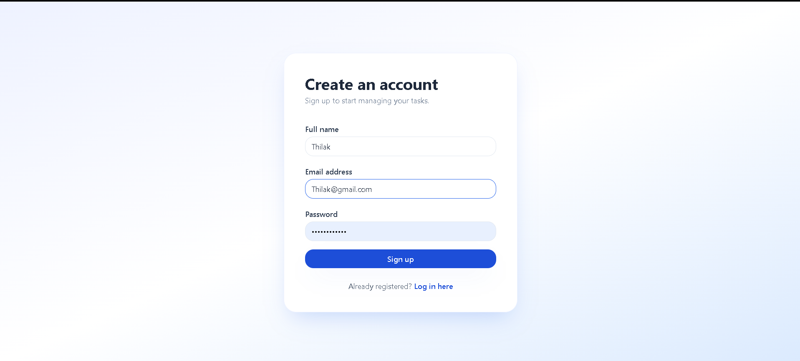
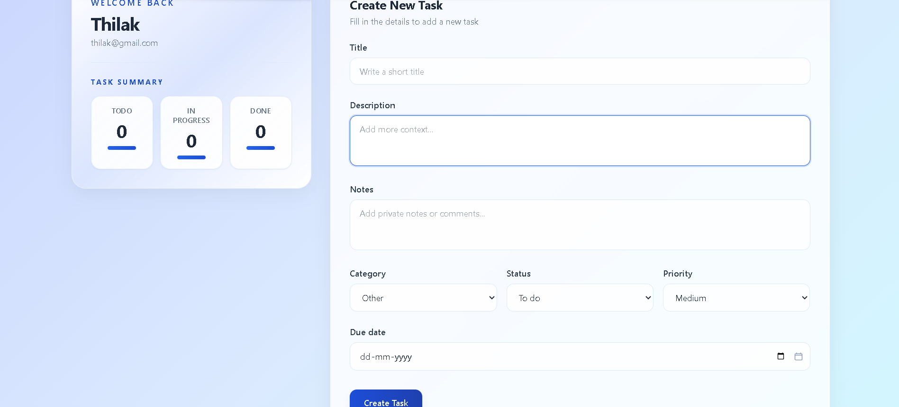
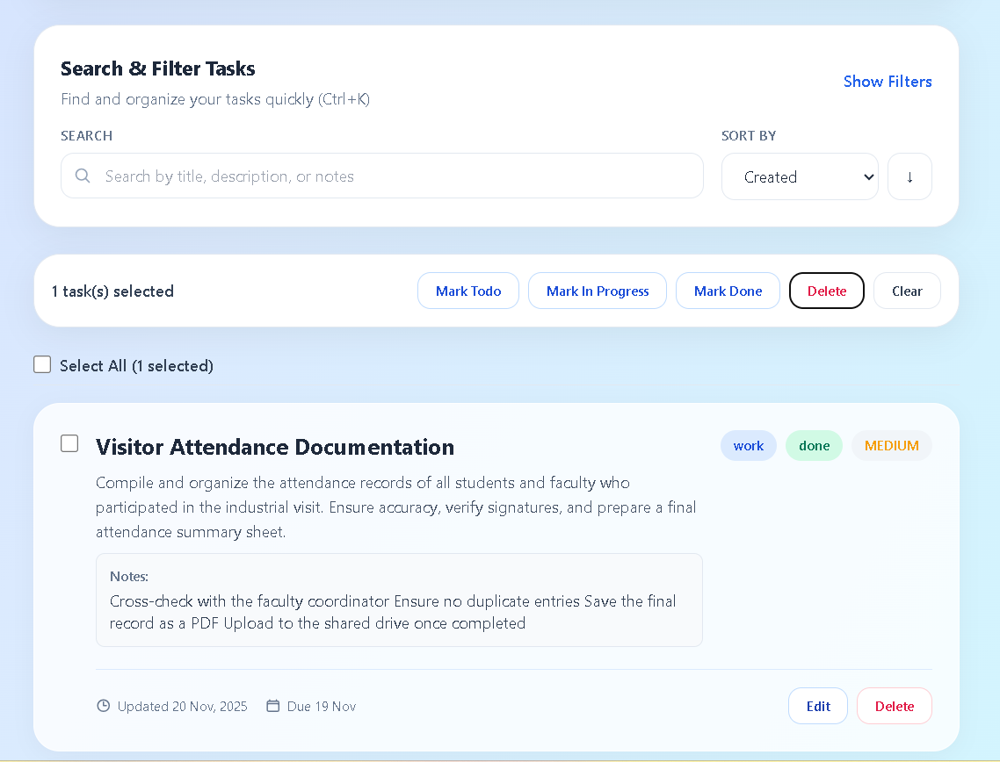
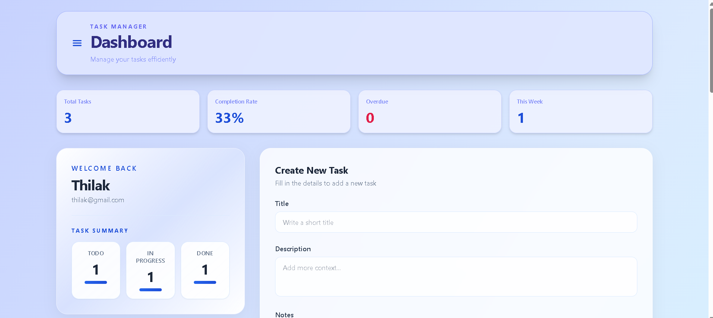
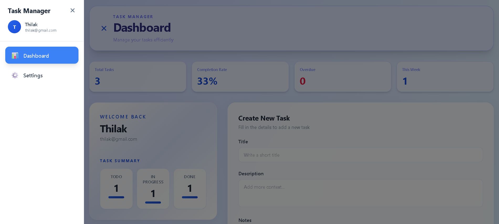

# 🚀 Fullstack Authentication Dashboard

A scalable full-stack web application built with **React (Vite) + Node.js + Express + MongoDB**, featuring secure authentication, protected routes, and a CRUD-enabled dashboard.

This project is created for the **Frontend Developer Intern Assignment**.

---

## 📌 Project Overview

This application demonstrates:

- Modern UI with React + TailwindCSS  
- Secure user authentication using JWT  
- Full frontend–backend integration  
- CRUD operations (Tasks / Notes)  
- Scalable folder structure for production  
- Search & filter functionality  
- Fully responsive UI  

---

## 🧰 Tech Stack

### **Frontend**
- React.js (Vite)
- TailwindCSS
- React Router
- Axios
- Zustand (Authentication store)
- LocalStorage (Token handling)

### **Backend**
- Node.js
- Express.js
- MongoDB + Mongoose
- JSON Web Tokens (JWT)
- bcryptjs (password hashing)
- express-validator (validation)
- CORS middleware
- dotenv

### **Tools**
- Postman (API Testing)
- GitHub
- VS Code

---

## 📂 Folder Structure

```
d:\user-management-dashboard\
├── frontend/
│   ├── public/
│   ├── src/
│   │   ├── components/
│   │   ├── pages/
│   │   ├── hooks/
│   │   ├── services/
│     │   ├── shared/
│   │   ├── store/
│   │   ├── App.jsx
│   │   ├── main.jsx
│   │   └── router.jsx
│   ├── .env
│   ├── package.json
│   └── README.md
│
├── backend/
│   ├── src/
│   │   ├── config/
│   │   ├── controllers/
│   │   ├── middleware/
│   │   ├── models/
│   │   ├── routes/
│   │   ├── utils/
│   │   ├── validators/
│   │   └── app.js
│   ├── server.js
│   ├── .env
│   ├── package.json
│   └── README.md
│
├── postman/
│   └── api_collection.json
│
├── logs/
│   └── server.log
│
└── README.md
```

---

## 🔐 Features

### ✔ Authentication (JWT)
- User Signup  
- Login  
- Logout  
- Password hashing (bcryptjs)  
- Protected routes  

### ✔ Dashboard
- Display user profile  
- CRUD operations  
- Search & filter  
- Fully responsive  

---

## ⚙️ How to Run the Project

### **Backend**
```bash
cd backend
npm install
npm start
```

### **Frontend**
```bash
cd frontend
npm install
npm run dev
```

---

## 📬 API Documentation

Import from:
```
postman/api_collection.json
```

---

## 📈 Scalability Notes

- JWT refresh token system  
- Deploy to Vercel + Render  
- MongoDB Atlas  
- RBAC roles  
- Redis caching  
- Load balancers & microservices (future)

---

# 📸 Screenshots

Below are step-by-step screenshots of the app.  
Place images inside the `screenshot/` folder.

### 1️⃣ Home / Login Page


### 2️⃣ Dashboard


### 3️⃣ Task List


### 4️⃣ Create Task



### 5️⃣ Edit Task


### 6️⃣ User Profile


### 7️⃣ Logout Flow


---

## 🙌 Author

**Thilak Raj P**  
Frontend Developer Intern Candidate  
GitHub: https://github.com/Thilak807/user-management-dashboard  
Email: thilakrajp1234@gmail.com
